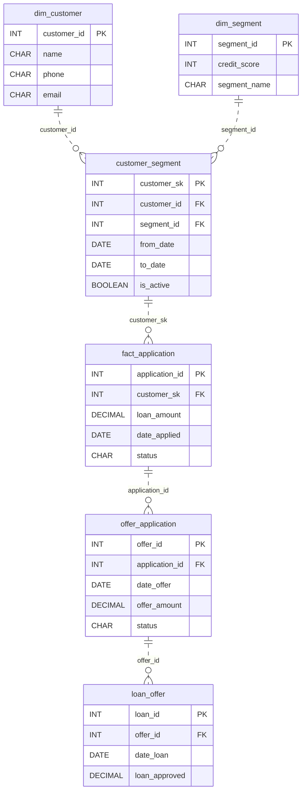

# Approval and After

*Approved, declined, or pending. Design the tables that say so.*

[Data Modeling · Medium · on DataDriven](https://datadriven.io/problems/approval_and_after)

## How it went

| | |
|---|---|
| Solved | 2026-10-08 |
| Accepted | on the 2nd submission |
| Hints | none |
| Concepts | Constraints, Data Types, Denormalization, Entities, 1NF, Foreign Keys, One-to-Many, One-to-One, Primary Keys, 2NF, Surrogate Keys, 3NF |

## The design

The accepted design is in [`schema.sql`](./schema.sql) as DDL and in [`schema.json`](./schema.json) as JSON.
