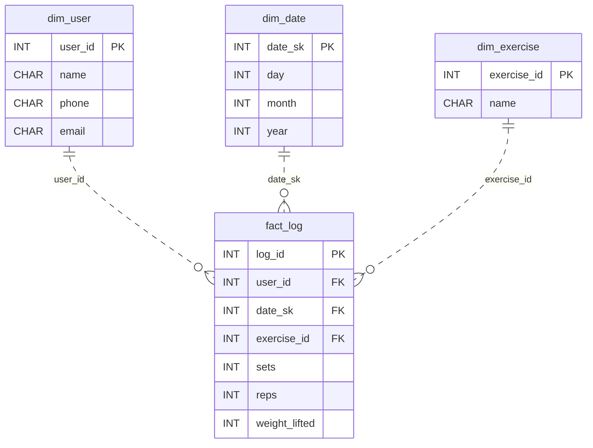

# Personal Best

*Reps, sets, streaks, and personal bests. Gym rats love their stats.*

[Data Modeling · Easy · on DataDriven](https://datadriven.io/problems/personal_best)

## How it went

| | |
|---|---|
| Solved | 2026-10-08 |
| Accepted | on the 2nd submission |
| Hints | none |
| Concepts | Attributes, Data Types, Entities, 1NF, Foreign Keys, Grain Definition, One-to-Many, Primary Keys, 2NF, 3NF |

## The design

The accepted design is in [`schema.sql`](./schema.sql) as DDL and in [`schema.json`](./schema.json) as JSON.
