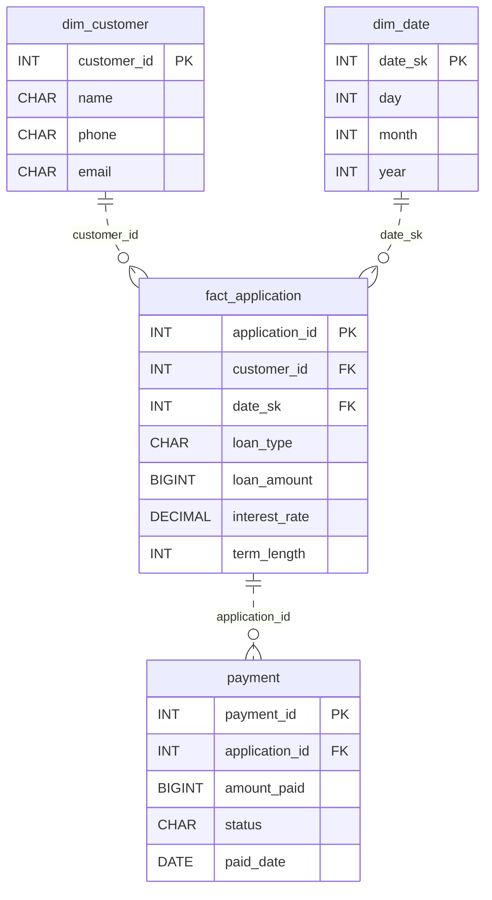

# The Balance Always Reconciles

*Money out, payments back. The balance has to be exact.*

[Data Modeling · Easy · on DataDriven](https://datadriven.io/problems/the_balance_always_reconciles)

## How it went

| | |
|---|---|
| Solved | 2026-10-09 |
| Accepted | on the 3rd submission |
| Hints | none |
| Concepts | Attributes, Constraints, Entities, 1NF, Foreign Keys, Grain Definition, Immutable Logs, Key Generation, Metric Additivity, One-to-Many, Primary Keys, 2NF, Surrogate Keys, 3NF |

## The design

The accepted design is in [`schema.sql`](./schema.sql) as DDL and in [`schema.json`](./schema.json) as JSON.
