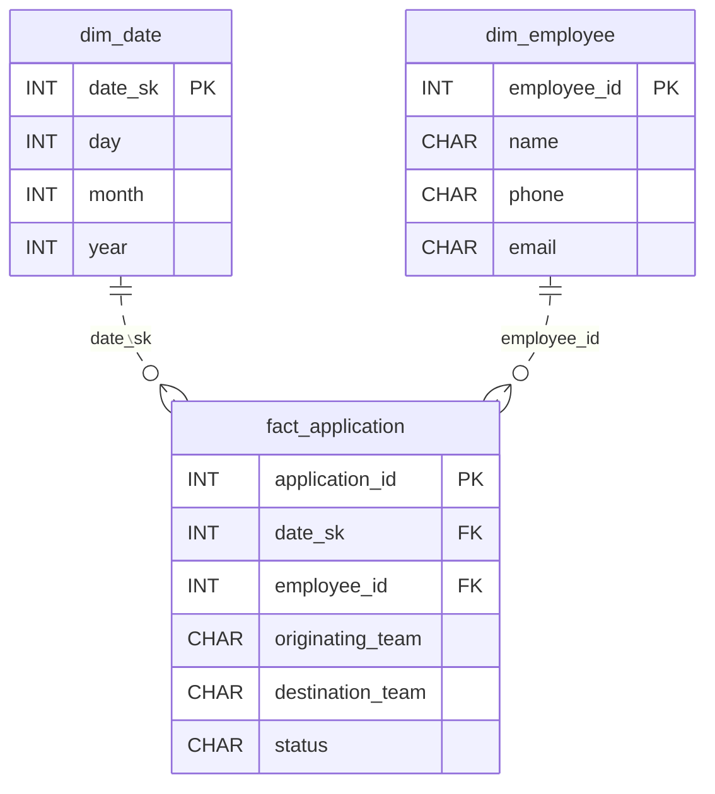

# The Transfer Request

*Apply, wait, get approved or denied. Track all of it.*

[Data Modeling · Medium · on DataDriven](https://datadriven.io/problems/the_transfer_request)

## How it went

| | |
|---|---|
| Solved | 2026-10-08 |
| Accepted | on the first submission |
| Hints | none |
| Concepts | Attributes, Cardinality, Constraints, Data Types, Dimension Tables, Entities, Fact Tables, 1NF, Foreign Keys, Grain Definition, Metric Additivity, One-to-Many, Primary Keys, 2NF, Star Schema, Surrogate Keys, 3NF |

## The design

The accepted design is in [`schema.sql`](./schema.sql) as DDL and in [`schema.json`](./schema.json) as JSON.
