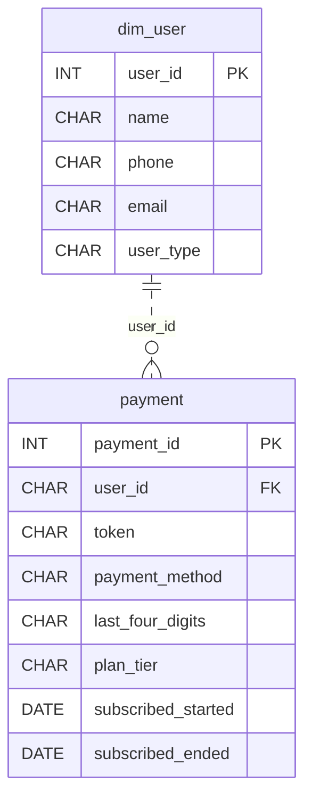

# Two Wallets

*Two user types. Multiple payment methods. One messy billing table.*

[Data Modeling · Medium · on DataDriven](https://datadriven.io/problems/two_wallets)

## How it went

| | |
|---|---|
| Solved | 2026-10-09 |
| Accepted | on the 2nd submission |
| Hints | none |
| Concepts | Constraints, Data Types, Dimension Tables, Entities, Fact Tables, 1NF, Foreign Keys, Grain Definition, Immutable Logs, Key Generation, One-to-Many, Primary Keys, 2NF, Star Schema, Surrogate Keys, 3NF |

## The design

The accepted design is in [`schema.sql`](./schema.sql) as DDL and in [`schema.json`](./schema.json) as JSON.
