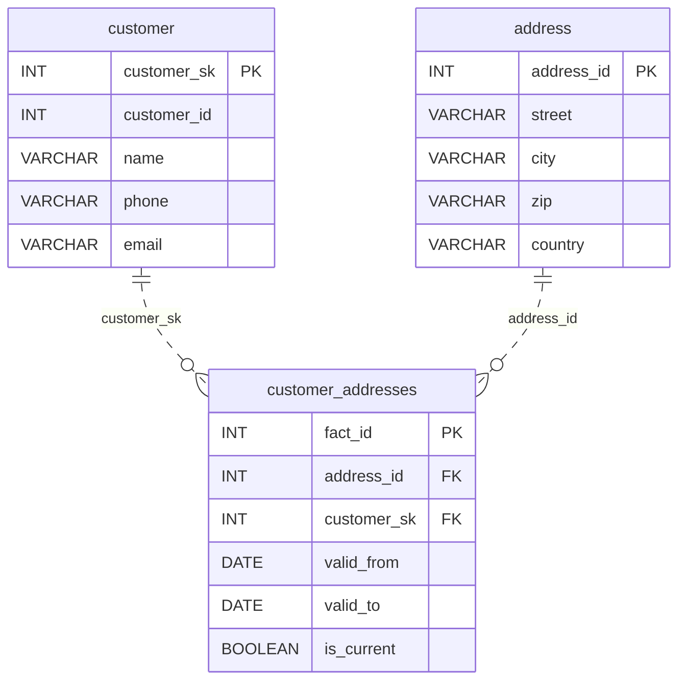

# Where Everyone Was

*People move. Sometimes twice in a month. How do you remember where everyone was, and when?*

[Data Modeling · Easy · on DataDriven](https://datadriven.io/problems/where_everyone_was)

## How it went

| | |
|---|---|
| Solved | 2026-06-07 |
| Accepted | on the 2nd submission |
| Time | 4 min |
| Hints | none |
| Concepts | Attributes, Constraints, Data Types, Entities, Foreign Keys, Junction Tables, Many-to-Many, One-to-Many, Primary Keys, SCD Strategy, SCD Type 2, Surrogate Keys |

## The design

The accepted design is in [`schema.sql`](./schema.sql) as DDL and in [`schema.json`](./schema.json) as JSON.
