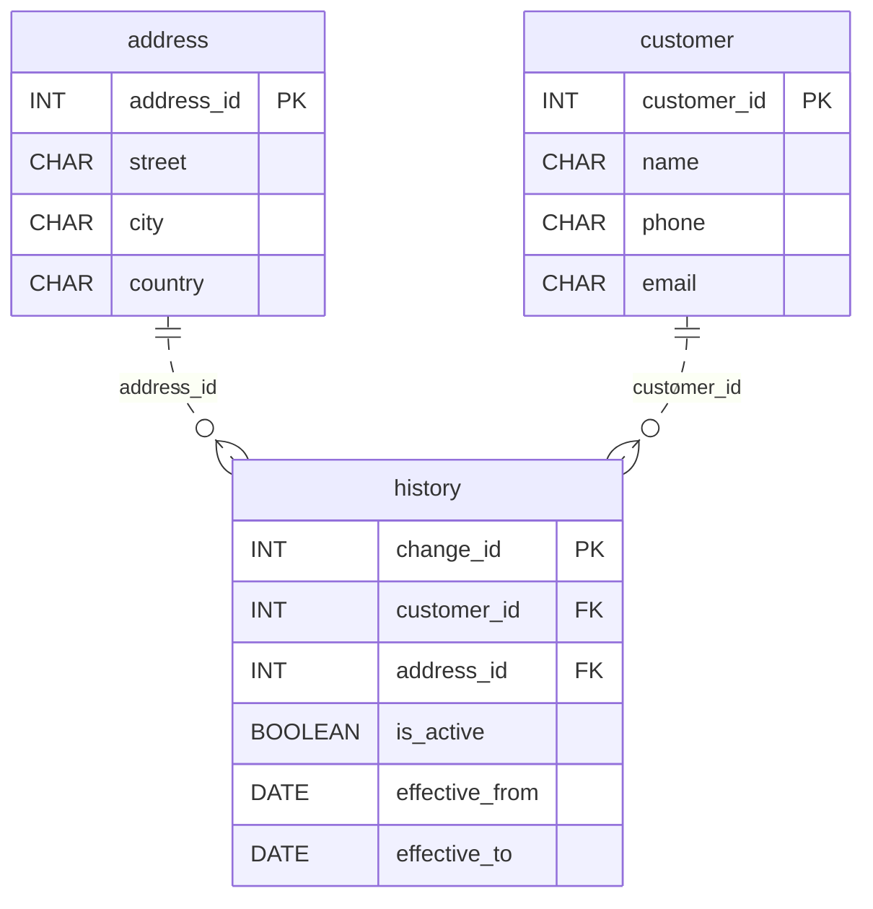

# Where They Used to Live

*They moved. The data stayed behind.*

[Data Modeling · Medium · on DataDriven](https://datadriven.io/problems/where_they_used_to_live)

## How it went

| | |
|---|---|
| Solved | 2026-10-05 |
| Accepted | on the first submission |
| Hints | none |
| Concepts | Constraints, Entities, Foreign Keys, Junction Tables, Many-to-Many, One-to-Many, Primary Keys, SCD Type 2, Surrogate Keys, 3NF |

## The design

The accepted design is in [`schema.sql`](./schema.sql) as DDL and in [`schema.json`](./schema.json) as JSON.
